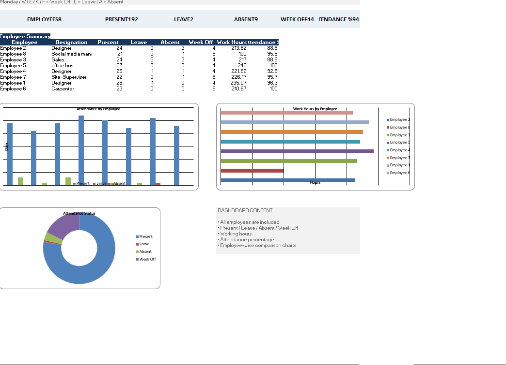

# Employee Attendance Analytics Dashboard

## 📊 Project Overview
An Excel-based employee attendance analytics project that demonstrates data cleaning, KPI calculation, employee-wise summaries, and dashboard visualization.

## 🎯 Objectives
- Clean raw attendance data
- Create calculation-ready attendance data
- Build employee-wise summaries
- Calculate attendance KPIs
- Analyze Present, Leave, Absent, Week Off and Work Hours
- Build management-friendly charts and dashboard

## 🛠️ Tools
- Microsoft Excel
- Excel formulas
- Data cleaning and transformation
- KPI calculations
- Summary tables
- Excel charts
- Dashboard design

## 📌 KPIs
- **Total Employees:** Number of unique employees
- **Present:** Total employee-day records marked Present
- **Leave:** Records with `L`
- **Absent:** Records with `A`
- **Week Off:** Monday plus `W`, `E`, `K`, `F`
- **Work Hours:** Total recorded working hours
- **Attendance %:** `Present / (Present + Leave + Absent) × 100`

Week-off records are excluded from the attendance percentage.

## 📋 Business Rules
- Monday = Week Off
- W = Week Off
- E = Week Off
- K = Week Off
- F = Week Off
- L = Leave
- A = Absent

## 🔄 Workflow
```text
Raw Data
   ↓
Data Cleaning
   ↓
Attendance_Data
   ↓
Employee_Summary
   ↓
KPI Calculations
   ↓
Chart_Data
   ↓
Dashboard
```

## 📁 Repository Structure
```text
Employee-Attendance-Analytics-Dashboard/
├── README.md
├── data/
│   └── attendance_sample_anonymized.xlsx
├── dashboard/
│   └── Employee_Attendance_Dashboard_Anonymized.xlsx
├── screenshots/
└── documentation/
    └── KPI_Definitions.md
```

## 📊 Dashboard

The dashboard provides:
- Overall attendance KPIs
- Employee-wise attendance comparison
- Employee-wise work-hour comparison
- Attendance status chart
- Employee summary

### Dashboard Preview


## 🔐 Privacy
This public portfolio version uses anonymized employee names. Do **not** upload the original company attendance file or any file containing real employee personal information.

## 💼 Resume Description
**Employee Attendance Analytics Dashboard | Microsoft Excel**

Cleaned and transformed employee attendance data, created employee-wise KPI summaries, and developed an Excel dashboard to analyze attendance, leave, absence, week-offs, working hours, and employee performance.

## 🚀 Future Improvements
- Power BI version
- Interactive employee-level charts
- Monthly attendance trends
- Late-arrival analysis
- Department-level analysis
- Power Query automation
